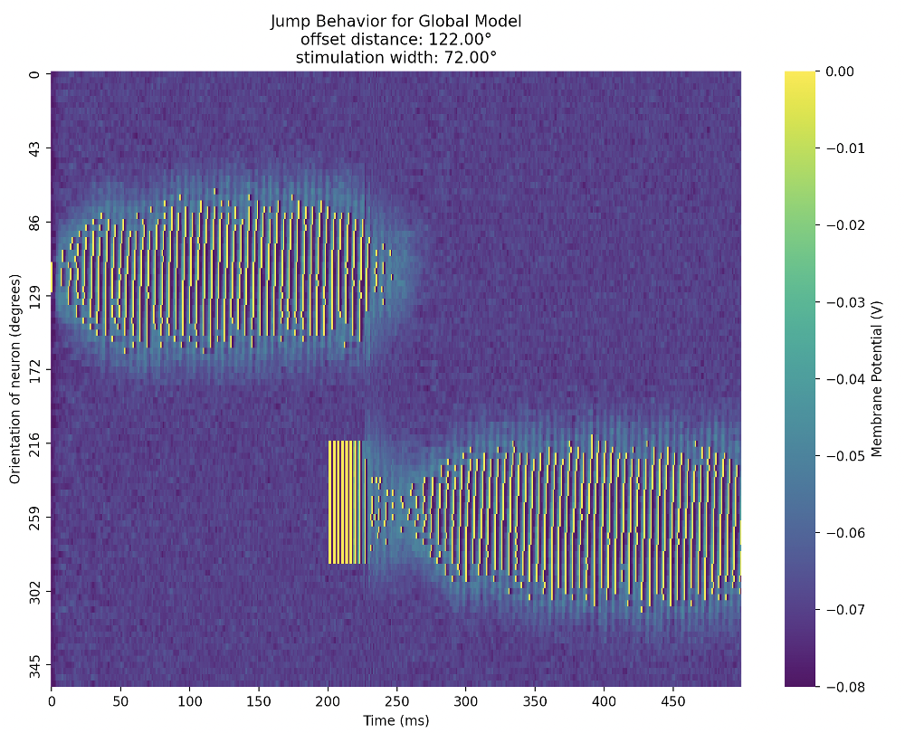

# ring-attractor-model
Engineered ring attractor models and demonstrated that a locally connected network of neurons is used in Drosophila melanogaster’s Ellipsoid Body to represent flying direction. Verified claims of [theoretical neuroscience paper.](https://doi.org/10.1126/science.aal4835)

## Jump vs Flow space

## Local Model

## Global Model

Started project by modelling single neurons through the Hodgkin-Huxley mathematical description. Used information theory concepts to evaluate different abstractions and approximations to enable computation of more complex process such as stochastic inputs, dynamics of neural networks with excitatory \& inhibitory neurons, synapse plasticity, and learning.
